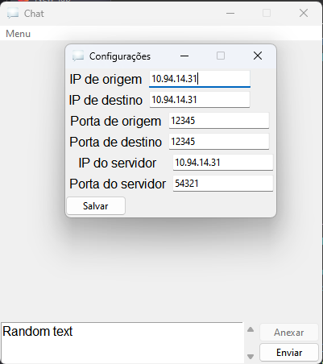
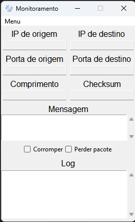

# RDT

Simula o protocolo RDT(do livro do professor Kurose) entre dois computadores, a fim de realizar uma transferência confiável de dados com o UDP. Trabalho antigo feito para a disciplina Redes de Computadores.

O arquivo do servidor é responsável por detectar os pacotes sendo enviados entre os dois computadores e intervir seja corrompendo-os ou perdendo-os.

# Screenshots

## Chat

## Servidor

